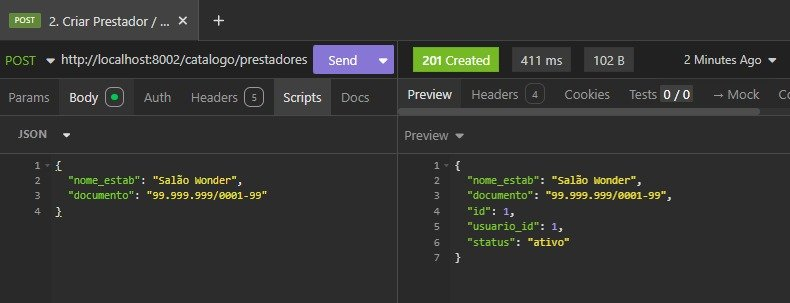
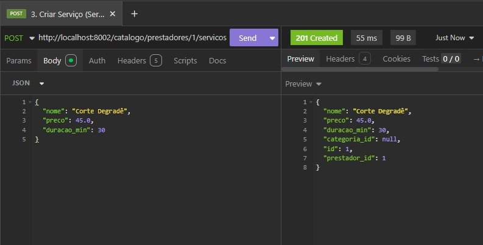
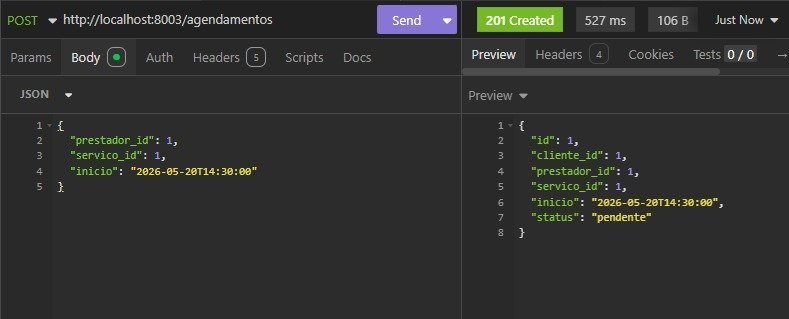
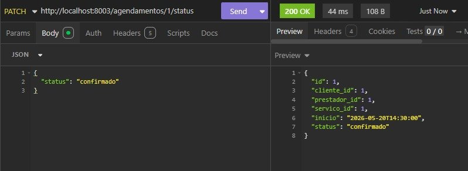
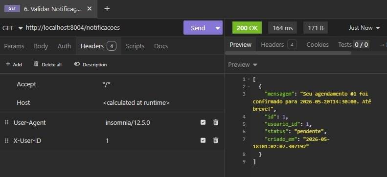
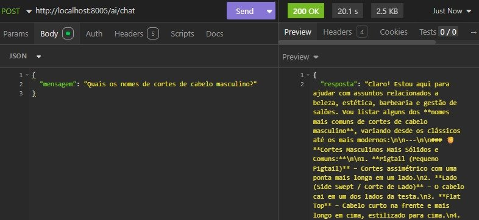
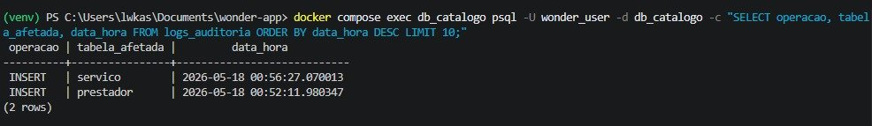
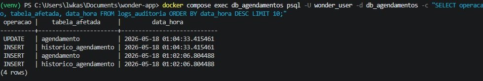
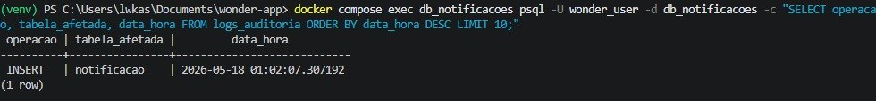

# Relatório de Auditoria — Wonder App

Documento de evidências do funcionamento do sistema de auditoria automática via triggers PL/pgSQL no PostgreSQL, validado em ambiente Docker Compose com fluxo ponta a ponta.

---

## Queries utilizadas

As queries abaixo foram executadas diretamente nos containers Docker para validar os registros de auditoria:

```sql
SELECT operacao, tabela_afetada, data_hora
FROM logs_auditoria
ORDER BY data_hora DESC
LIMIT 10;
```

Executadas via:
```bash
docker compose exec db_catalogo psql -U wonder_user -d db_catalogo -c "SELECT operacao, tabela_afetada, data_hora FROM logs_auditoria ORDER BY data_hora DESC LIMIT 10;"
docker compose exec db_agendamentos psql -U wonder_user -d db_agendamentos -c "SELECT operacao, tabela_afetada, data_hora FROM logs_auditoria ORDER BY data_hora DESC LIMIT 10;"
docker compose exec db_notificacoes psql -U wonder_user -d db_notificacoes -c "SELECT operacao, tabela_afetada, data_hora FROM logs_auditoria ORDER BY data_hora DESC LIMIT 10;"
```

---

## Fluxo validado

### 1. Criar Prestador — `POST /catalogo/prestadores`

Requisição criando o estabelecimento "Salão Wonder" com documento `99.999.999/0001-99`.
Resposta com `201 Created`, retornando `id: 1`, `usuario_id: 1`, `status: "ativo"`.



---

### 2. Criar Serviço — `POST /catalogo/prestadores/1/servicos`

Requisição criando o serviço "Corte Degradê" com preço R$ 45,00 e duração de 30 minutos vinculado ao prestador `id: 1`.
Resposta com `201 Created`.



---

### 3. Criar Agendamento — `POST /agendamentos`

Requisição criando agendamento para `2026-05-20T14:30:00` com prestador `id: 1` e serviço `id: 1`.
Resposta com `201 Created`, status `"pendente"`.



---

### 4. Atualizar Status — `PATCH /agendamentos/1/status`

Requisição atualizando o status do agendamento `id: 1` de `"pendente"` para `"confirmado"`.
Resposta com `200 OK`.



---

### 5. Validar Notificação — `GET /notificacoes`

Notificação criada automaticamente pelo consumer RabbitMQ após o agendamento.
Mensagem: `"Seu agendamento #1 foi confirmado para 2026-05-20T14:30:00. Até breve!"`.
Status `"pendente"`, `usuario_id: 1`.



---

### 6. Assistente de IA — `POST /ai/chat`

Pergunta enviada: `"Quais os nomes de cortes de cabelo masculino?"`
Resposta gerada pelo modelo via OpenRouter com sugestões de cortes masculinos relevantes ao contexto do Wonder.
Resposta com `200 OK`.



---

## Logs de Auditoria nos Bancos

### db_catalogo — Triggers de INSERT

Após criação do prestador e do serviço, os triggers registraram automaticamente em `logs_auditoria`:

| operacao | tabela_afetada | data_hora |
|----------|----------------|-----------|
| INSERT   | servico        | 2026-05-18 00:56:27 |
| INSERT   | prestador      | 2026-05-18 00:52:11 |



---

### db_agendamentos — Triggers de INSERT e UPDATE

Após criação e atualização de status do agendamento, os triggers registraram em `logs_auditoria`:

| operacao | tabela_afetada        | data_hora |
|----------|-----------------------|-----------|
| UPDATE   | agendamento           | 2026-05-18 01:04:33 |
| INSERT   | historico_agendamento | 2026-05-18 01:04:33 |
| INSERT   | agendamento           | 2026-05-18 01:02:06 |
| INSERT   | historico_agendamento | 2026-05-18 01:02:06 |



---

### db_notificacoes — Trigger de INSERT

Após o consumer RabbitMQ processar o evento e criar a notificação, o trigger registrou em `logs_auditoria`:

| operacao | tabela_afetada | data_hora |
|----------|----------------|-----------|
| INSERT   | notificacao    | 2026-05-18 01:02:07 |



---

## Conclusão

Todos os critérios de auditoria foram validados com sucesso:

- ✅ `db_catalogo` — logs de INSERT em `prestador` e `servico`
- ✅ `db_agendamentos` — logs de INSERT e UPDATE em `agendamento` e `historico_agendamento`
- ✅ `db_notificacoes` — log de INSERT em `notificacao` gerado pelo consumer RabbitMQ
- ✅ Triggers PL/pgSQL funcionando automaticamente sem código adicional no Python
- ✅ Fluxo ponta a ponta validado: Login → Catálogo → Agendamento → Notificação → IA
